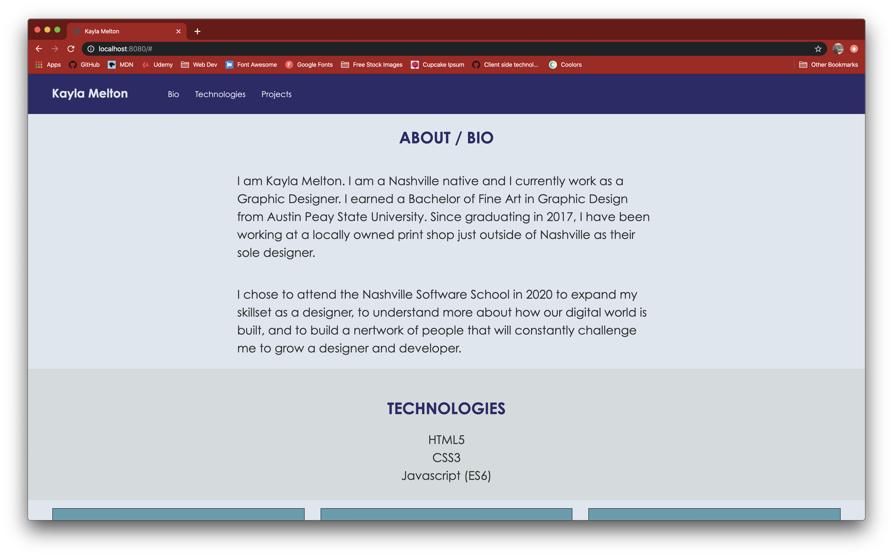
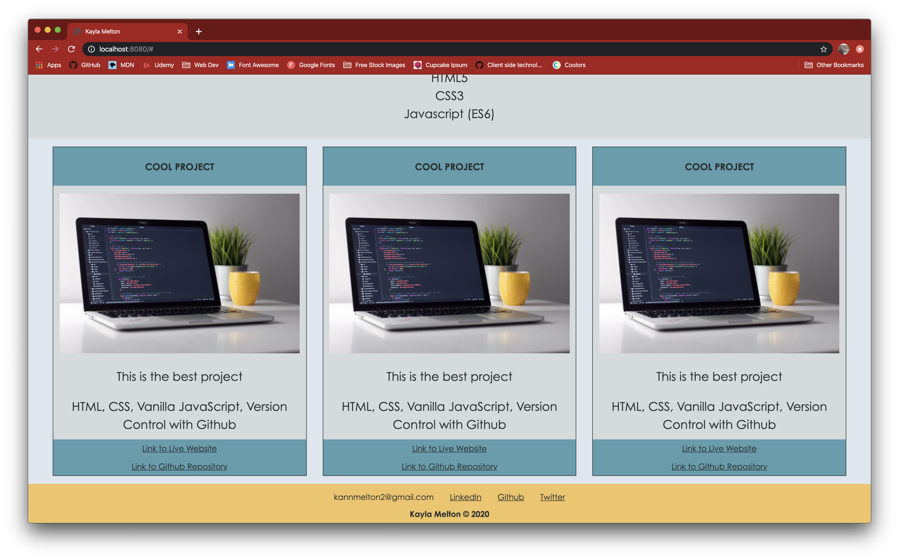

# personal-bio-site

## Description
A personal biographical website made to display projects I have created as a developer. Project cards are dynamically created using vanilla javascript, and custom colors match personal branding. The cards, navbar, and other elements are styled using a combination of bootstrap and my own css.

## Screenshots

## Instructions
1. Clone down this repo
2. Make sure you have http-server installed via npm. If not get it here [HERE](https://www.npmjs.com/package/http-server)
3. On your command line run `hs -p 9999`
4. In your browser go to `http://localhost:9999`